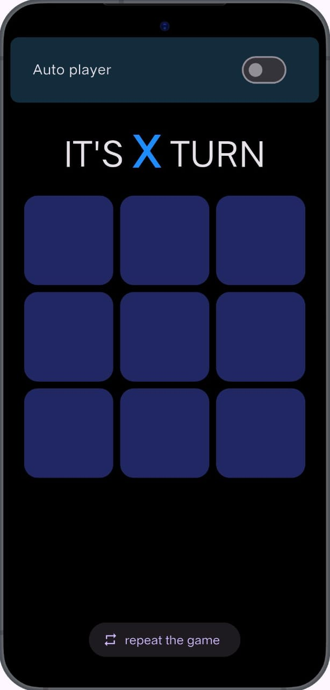
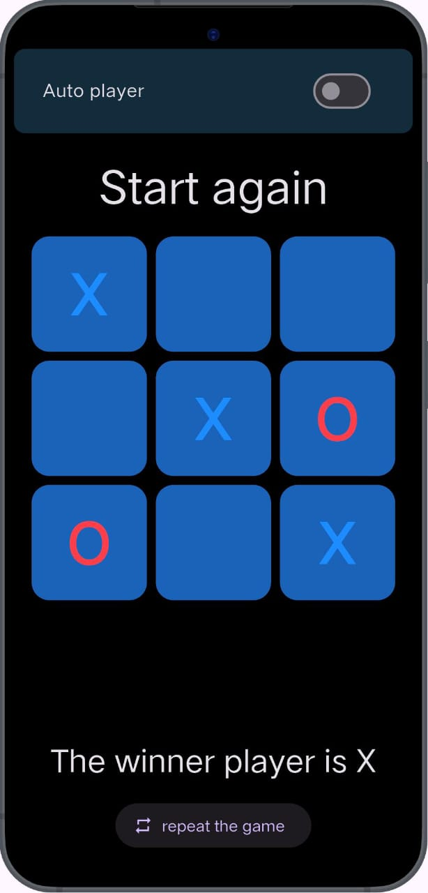
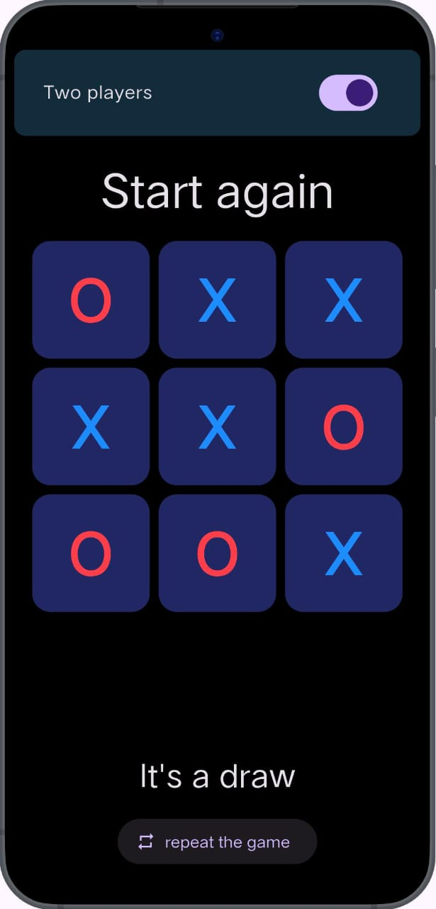

# Tic Tac Toe

A simple, cross-platform Tic Tac Toe game built with Flutter.

## Table of Contents

- [About](#about)
- [Features](#features)
- [Getting Started](#getting-started)
- [How to Play](#how-to-play)
- [Screenshots](#screenshots)
- [Contributing](#contributing)
- [License](#license)

## About

**Tic Tac Toe** is a classic two-player game where players take turns marking spaces in a 3×3 grid. The player who succeeds in placing three of their marks in a horizontal, vertical, or diagonal row wins the game. This project is a Flutter implementation of the game, designed to run on Android, iOS, web, Windows, macOS, and Linux.

## Features

- Play against another player on the same device
- Play the the smart auto player
- Simple and intuitive user interface
- Game reset functionality
- Highlights the winner or declares a draw

## Getting Started

To run this project locally:

1. **Clone the repository:**

   ```sh
   git clone https://github.com/Abdalrahman1723/tic-tac-game
   cd tic_tac
   ```

2. **Install dependencies:**

   ```sh
   flutter pub get
   ```

3. **Run the app:**
   - For mobile:
     ```sh
     flutter run
     ```
   - For web:
     ```sh
     flutter run -d chrome
     ```
   - For desktop (Windows, macOS, Linux):
     ```sh
     flutter run -d windows  # or macos/linux
     ```

> **Note:** Make sure you have Flutter installed. See the [Flutter installation guide](https://docs.flutter.dev/get-started/install) for help.

## How to Play

- The game board consists of a 3x3 grid.
- Two players take turns: Player 1 (X) and Player 2 (O).
- You can switch the auto player button on
- Tap an empty cell to place your mark.
- The first player to align three marks horizontally, vertically, or diagonally wins.
- If all cells are filled and no player has three in a row, the game ends in a draw.
- Use the reset button to start a new game.

## Screenshots

<!-- Add screenshots of your app here -->




## Contributing

Contributions are welcome! Please open issues or submit pull requests for improvements and bug fixes.

## License

This project is licensed under the MIT License. See the [LICENSE](LICENSE) file for details.
